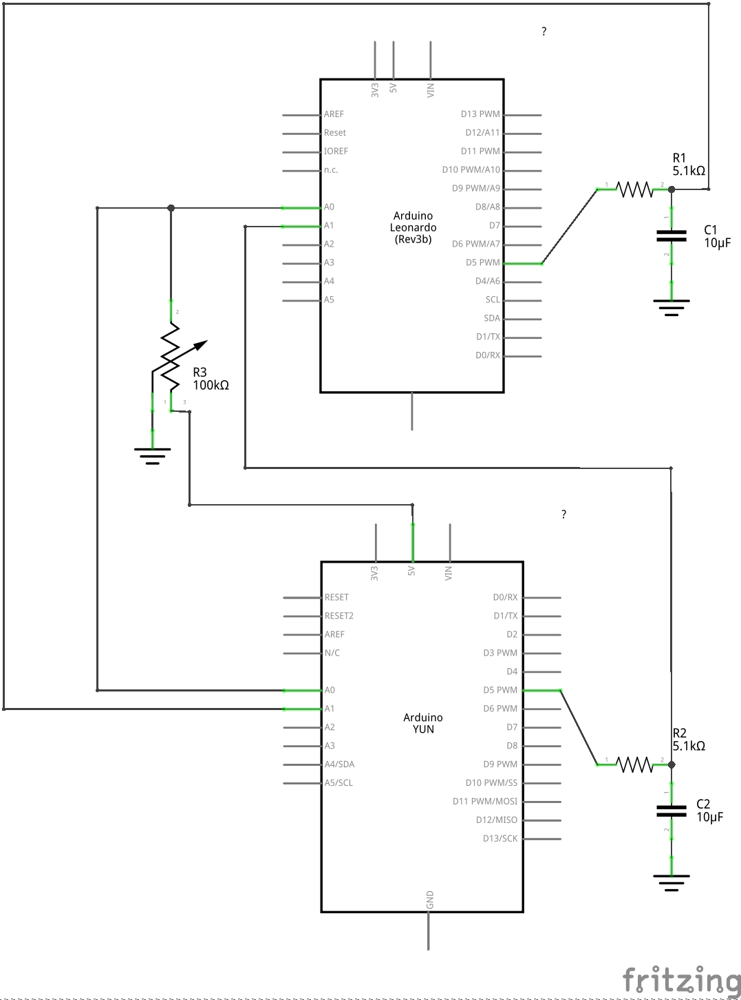

# Arduino Neuron #UAM50

Código fuente del material para la exposición [Universidad Autónoma de Madrid: 50 años haciendo futuro](https://50aniversario.uam.es/expouam50/)

Dos neuronas ([iz.ino](https://github.com/GNB-UAM/Arduino_Neuron_UAM50/blob/master/iz.ino)) implementadas para arduino conectadas por una sinapsis eléctrica regulable 

## Esquemático

